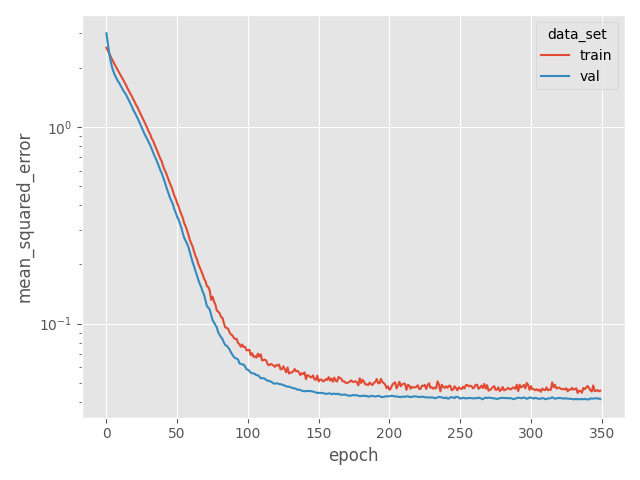
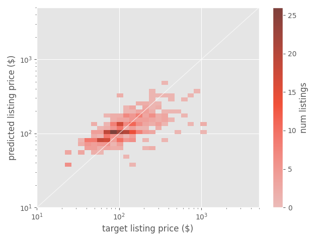
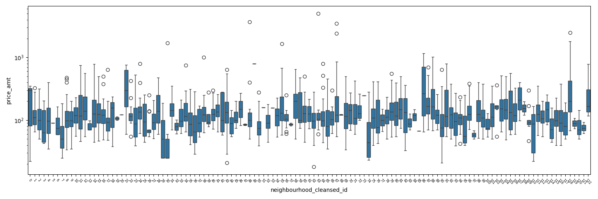

# abb_model_demo

This code is intended to be indicative of my general coding style,
to show some basic data exploration and to demonstrate building
some very simple models using XGBoost and PyTorch.

Themes:
  * OO design with [composition over inheritance](https://pyvideo.org/pycon-us-2013/the-end-of-object-inheritance-the-beginning-of.html)
  * replaceable-modules-in-a-pipeline design
  * try to keep classes simple; don't over optimize
  * avoid abstract interfaces when only one implementation is needed
  * plan for future extensions / adaptations without implementing them before they're needed
  * implement working versions of models using 2024-current libraries (PyTorch, XGBoost)
  
## Usage

    git clone https://github.com/ogrefish/abb_model_demo.git
    [create and activate a python virtual environment]
    cd abb_model_demo
    pip install -e .
    
    # to train & visualize the simple PyTorch neural net model:
    python abb_model_demo/scripts/oak_seq_nn_train.py

## Roadmap

Development of this repo is planned as follow.

_Essential_
  1. [done] Data exploration plots
  1. [done] Feature, target preparation code impl
  1. [done] NN model code impl
  1. [done] Steering code to run NN model & produce summary plots
  1. [done] XGB model code impl 
  1. [done] Steering code to run XGB model & produce summary plots
  1. Doc strings for all classes and methods
  1. Unit tests for feature, target preparation

_Future nice-to-haves_
  1. Hyperparameter tuning & analysis
  1. Fix all random seeds to get fully reproducible results
  1. Dyanmically determine qualified class/method name in exceptions to prevent misleading error messages (in case of copy/paste/forget-to-edit)
  1. Improved feature engineering (categories -> embeddings)
  1. Additional data sources (descriptions, amenities, holidays)
  1. Additional model types (linear, SVR)

## Model Results

The accuracy of the model at predicting listing price is mostly ignored for the purposes of this demo. The data set is lacking some important features (see roadmap above and data set description below).

The purpose is more to:
  * Show the models successfully train
  * Demo some of the first plots I would want to see when creating such models
  
### PyTorch Neural Network

The loss curve for the train \& validation set. No sign of rampant over fitting. Positive signs that the loss optimizer converged.

The predicted listing prices versus the actual listing prices of the validation set. The y=x ideal line is shown in white. No signs of banding or clipping, which may indicate the loss optimizer did not converge to a good minimum, are present. The blob is generally sloped in a good direction.

### XGBoost

The loss curve for the train \& validation set. Also no sign of rampant over fitting. Looks like XGB hit a stable minimum.

The predicted listing prices versus the actual listing prices of the validation set. The y=x ideal line is shown in white. The blob is generally sloped in a good direction. Looks like XGB might be a little more precise but potentially less accurate than the NN model -- the blob looks thin, but many listings seem to be somewhat overpriced, particularly to $100.

## Data Set

The data set was obtained at

[http://data.insideairbnb.com/united-states/ca/oakland/2023-12-20/data/listings.csv.gz](http://data.insideairbnb.com/united-states/ca/oakland/2023-12-20/data/listings.csv.gz)

It contains a scrape of 2,749 AirBnB listings in Oakland, CA from December 20, 2023. The listings have been scrubbed (by insideairbnb.com) and do not contain text descriptions nor amenities. This data set (or an updated version) can be explored at [http://insideairbnb.com/oakland/](http://insideairbnb.com/oakland/).

    Normally, I would not include data in a code repo.
    
Data has been included here in order to make it easy for others to run the code.

## Data Exploration

See the following script which was used to visualize the listing price distributions segmented by various potential feature variables.

    scripts/oak_feature_explore.py 

### Capacity

The number of beds and number of people a listing can accommodate are often correlated with the listing price.

### Property Type

The data set has both a room type and a property type label. These two features are highly correlated with each other. For example, a listing with a room type "private room" will also have a property type "private apartment".

The property type feature was created by keeping only the first word of the property type. This buckets similar listings with similar price distributions together. The room type is not used as a feature, as it is redundant.

The first word of the property type does separate listing price.

### Availability

Listings that are not available generally have a higher price. On the buy side, this could indicate that the most desirable listings are the most likely to rent out, even if they cost more. On the lease side, this could reflect urgency to rent the listing out and avoid empty lodging that generates no income.

(Box plot used here because Seaborn did not draw layered 1D histograms nicely on log-counts vs log-price scale axes.)

### Neighborhood

The listing price does vary with neighborhood, although some neighborhoods have very few example listings.

A future improvement worth exploring could be to bucket neighborhoods with similar price distributions together to improve signal to noise for the model.

### Host Properties

Properties of the host, such as whether the host is verified or has a profile picture, does not have much discriminating power for listing price, as shown by the plots below. These variables are NOT used as features for predicting listing price.

